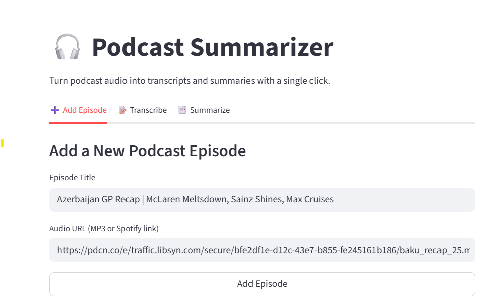
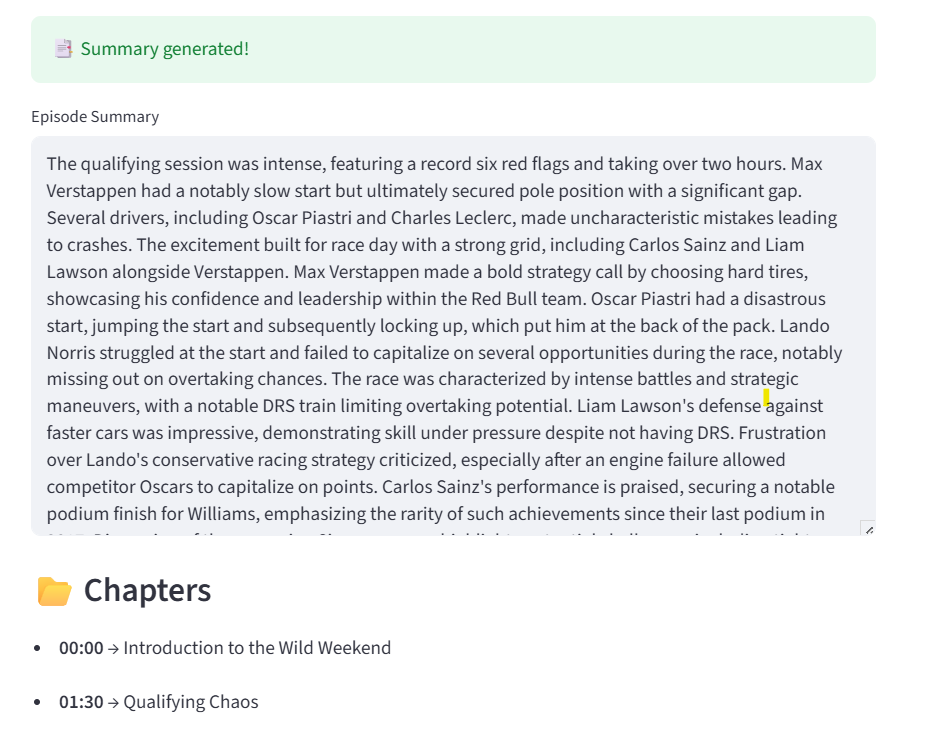

# 🎧 Podcast Summarizer

Personal end-to-end tool for podcast summarization. The tool can be used to **ingest podcast episodes**, generate **transcripts** with [WhisperX](https://github.com/m-bain/whisperX), and create **summaries, chapters, and key quotes** using LLMs — all accessible via a **FastAPI backend** and a lightweight **Streamlit frontend**.

---

## ✨ Features
- 🆕 Add podcast episodes by title + audio URL (MP3 or Spotify link).  
- 📝 Generate accurate transcripts using WhisperX with timestamped segments.
- 📑 Summarize transcripts into:
  - Episode summary 
  - Chapter breakdown with timestamps  
  - Key quotes extraction  
- 🔗 Backend REST API built with FastAPI.  
- 💻 User-friendly testing UI via Streamlit.  
- 🗄️ SQLite database.

---

## 📌 Small Demo 




## 🛠️ Tech Stack
- **Backend**: [FastAPI](https://fastapi.tiangolo.com/)  
- **Database**: [SQLite](https://www.sqlite.org/) with [SQLAlchemy ORM](https://www.sqlalchemy.org/)  
- **Transcription**: [WhisperX](https://github.com/m-bain/whisperX)  
- **Summarization**: prompted gpt-4o LLM (via `summarize_service`). 
- **Frontend**: [Streamlit](https://streamlit.io/)  
---

## 📂 Project Structure
```markdown
backend/
├── app/
│ ├── db/
│ │ ├── db.py # DB engine + session
│ │ ├── models.py # ORM models (Episode, Transcript, Summary)
│ │ └── init_db.py # Initialize tables
│ ├── routes/
│ │ ├── episodes.py # Add + fetch episodes
│ │ ├── transcripts.py # Transcribe with WhisperX
│ │ └── summaries.py # Summarize transcripts
│ └── services/
│ ├── transcript_service.py # WhisperX transcription logic
│ └── summarize_service.py # LLM summarization logic
│ └── main.py # FastAPI entrypoint
└── podcast.db # SQLite database
frontend/what co
└── frontend.py # Streamlit UI
```

## ⚙️ Installation & Setup

```bash
git clone https://github.com/your-username/podcast-summarizer.git #clone the repo
cd podcast-summarizer
python -m venv podcast_summarizer #create env and install dependencies
podcast_summarizer\Scripts\activate      # Windows
pip install -r requirements.txt
cd backend #init db
python -m app.db.init_db
uvicorn app.main:app --reload #run backend
cd frontend #in a new terminal run frontend
streamlit run frontend.py
```

## 🚀 Usage Flow

- **Add Episode** → `POST /episodes/` with `title` + `audio_url` (creates new episode, status = queued).  
- **Transcribe** → `POST /transcripts/{episode_id}` (runs WhisperX, saves transcript, status = transcribed).  
- **Summarize** → `POST /summaries/{episode_id}` (runs LLM, saves summary + chapters + quotes, status = done).  
- **View Results** → `GET /episodes/{episode_id}` (check status and retrieve episode details).
